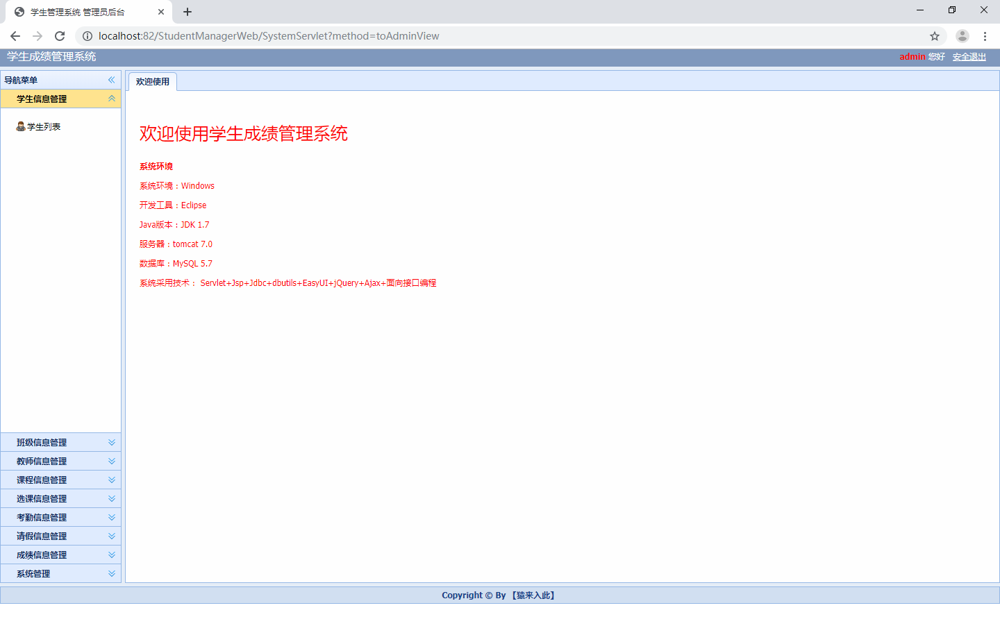
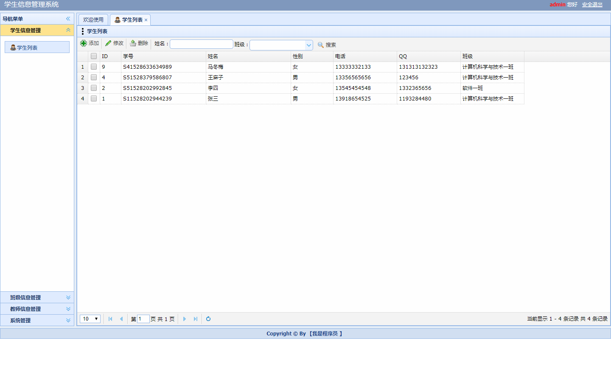
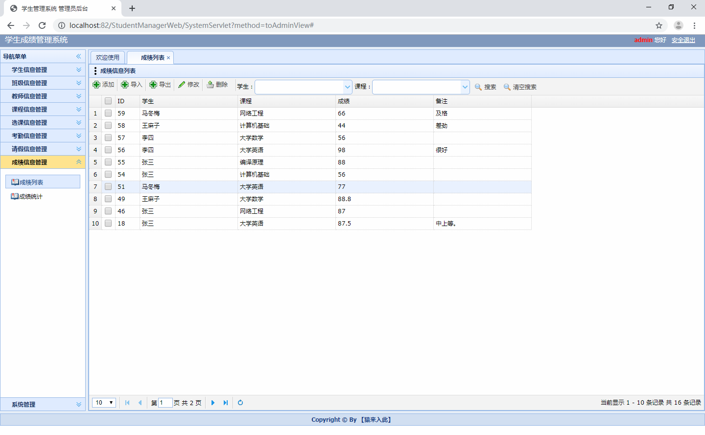
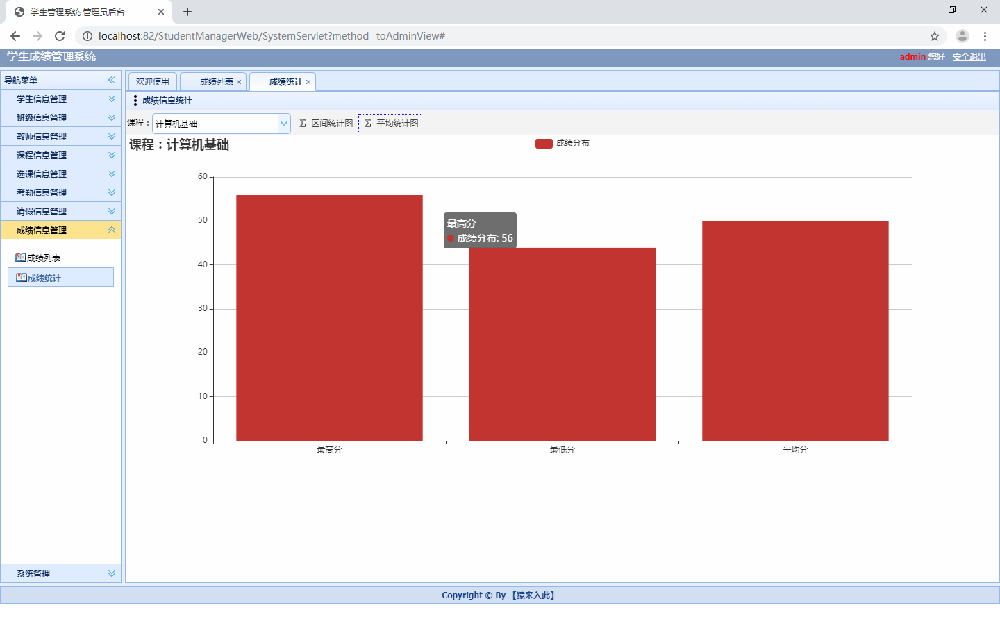
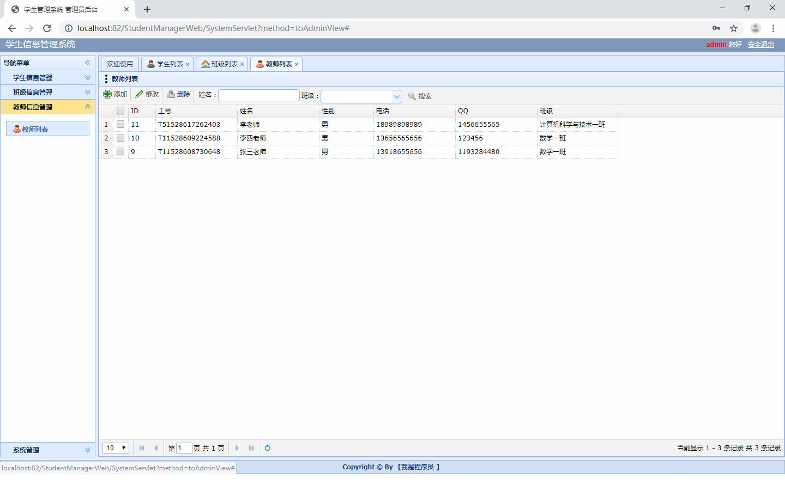
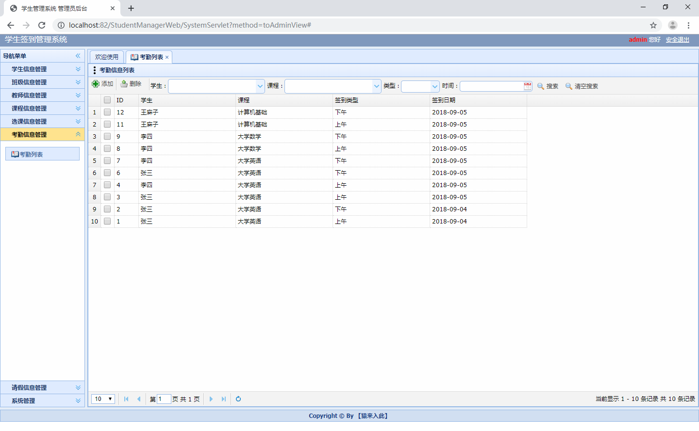
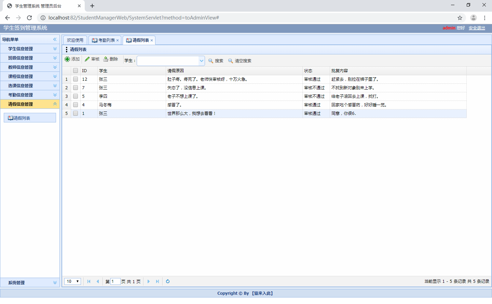
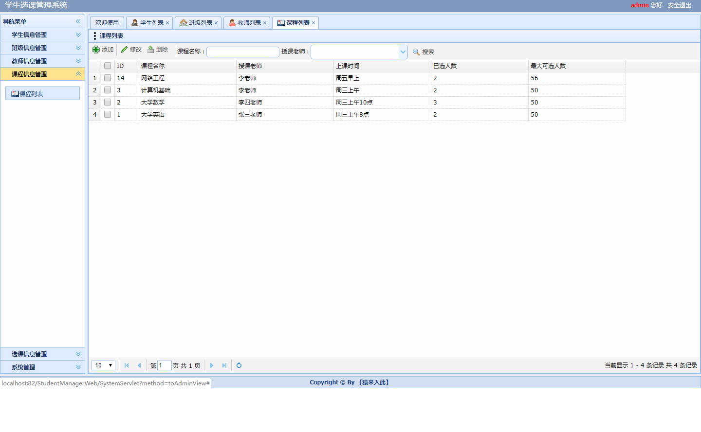
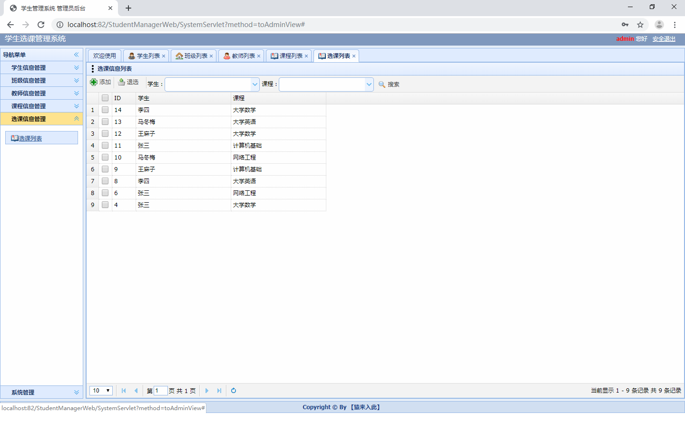

# javaee_scoreManager

项目代码已收录公众号【java项目源码】，需要请自行关注一下公众号并下载源码

CSDN博客地址：https://blog.csdn.net/mataodehtml/article/details/111983368

B站运行视频：暂无

基于javaee的成绩管理系统（serlvet+jsp+mysql）
javaEE学生成绩管理系统
框架：jsp+servlet+mysql+tomcat+layui+jquery+ajax
1.学生：考勤管理，请假，选课，查询成绩，修改个人信息等

2.教师：考勤管理，请假审核等，选课信息管理，学生信息管理，班级信息管理，
课程信息管理，成绩管理，成绩导入导出功能，成绩统计（可视化展示），修改个人信息等

3.管理员：比教师多一个教师管理

运行截图：

运行项目步骤：

1.项目导入本地后可能会出现红色感叹号，右键项目properties选择java build path修改对应红叉的配置

2.将sql文件导入本地数据库

3.将util下的DbUtil中修改本地数据库连接

4.右键项目运行

